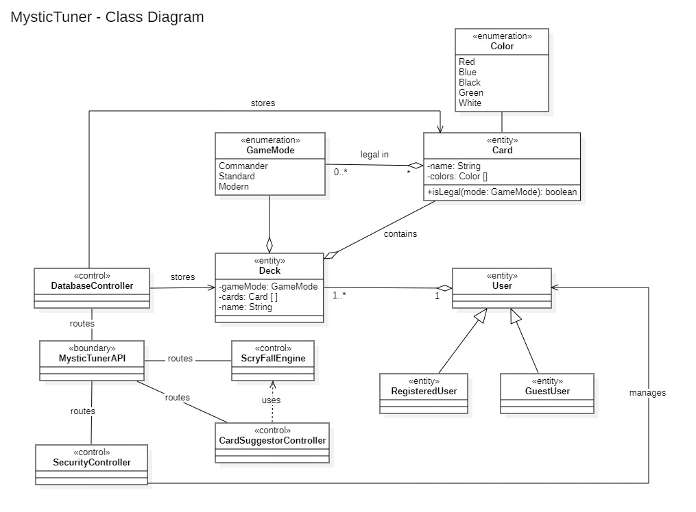
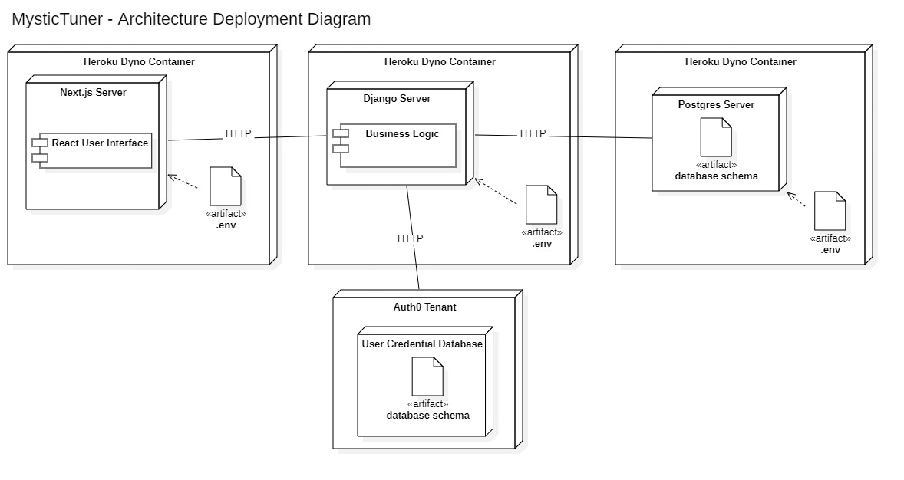
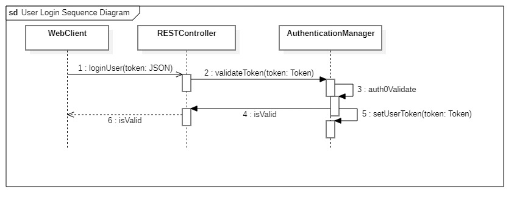
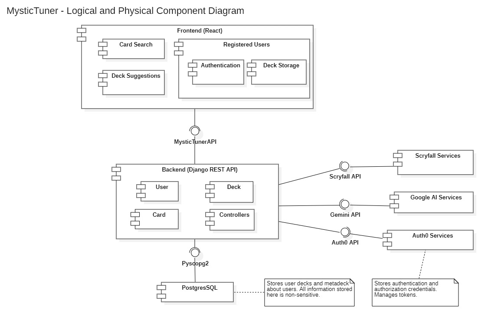

# SENG 401 PROJECT GROUP 7 Design Document
### Members
Sachin Seizer, Brendan SMILEY, Luca Rios, Cody Casselman, Rohan Lange and Wade Banman

# System architecture

For our project we made use of an MVC layered architecture.  Our application has three layers, with the database being the model, the backend being the controller and the frontend being the view segment of our application.  The database component makes use of PostGreSQL 17, the backend is written in Django and the frontend uses Next.js.  Each layer functions independently from one another, and when data is needed from another layer, the request and the data is transmitted through the necessary API call.  In adheranced with the MVC architecture, requests between the frontend (view) and database (model) go through the backend (controller).

# Project Diagrams

### Class Diagram

### Deployment Diagram

### Sequence Diagram

### Component Diagram

# Use of Design Patterns

DatabaseConnector - Singleton

As part of our functional requirements of having a single point of access to the database, the DatabaseConnector class
was built using a Singleton design pattern.  This design pattern was chosen as by only allowing one instance of the 
DatabaseConnector class to exist, then by consequence only one connection to the database can exist.

CardSuggestor - Strategy

As part of the strategy to keep our project scalable and adaptable to the future, we implemented the CardSuggestor class
with the Strategy design pattern.  Here, the strategy is what Large Language Model (LLM) is to be used for the card suggestions.
This choice was made to allow for easy changin of which kind of LLM our project would use.  This is important as years down the line
new, better LLMs may be released or the exisiting LLM we're using (currently the Gemini AI) may become inneffective or taken down.  
With the strategy pattern, we can easily create a new strategy using a different AI without have to change any existing code, adhering
to the open-close principle.

API routes - Decorator

All of our API routes make use of the decorator pattern in their request/response packages.  We wrap the the body of data with a header and other information.  By doing this, we're able to make flexibly structured requests between the frontend and backend.

useEffect (frontend) - Observer

In our frontend, we commonly make use of a javascript method called useEffect.  This method makes use of the Observer pattern, reacting to whenever the page loads or if any of the variables it's assigned to observe change.  It allows us to make a dynamic and responsive website that can easily respond to any user input.

# Adherance to SOLID Principles

In our project we made lots of effort to adhere our programming to the SOLID principles.  Here I will list how we did so for each principle.

### S - Single Responsibility

The database connection classes are a good example of adherance to single responsibility.  In the Database_Connector folder, there are three classes: 

DatabaseConnector, CardQueries, DeckQueries.  Each of these classes is responsible for a single job.  DatabaseConnector sends queries to the database, CardQueries builds queries for the Card table and Deckqueries builds queries for the Deck table.  

We also have other examples of classes that have only one responsibility, such as the ScryFallEngine class that focuses solely on communication information with the ScryFall API.

### O - Open-Close Principle

Our CardSuggestor class follows the Open-Close Principle.  By using the Strategy pattern, whenever a new LLM needs to be used, we can simply create a new strategy instead of having to modify the existing methods.

### L - Liskov Subtitution

In using python and due to the nature of our project, there weren't any instances of which this principle was applicable to our project.

### I - Interface Seggregation

In using python and due to the nature of our project, there aren't many instances of interfaces being used, but when they are, they're used accuractly and specifically.  One example we have is the DeckListTuner abstract class, that is specifically inherited by AI connector classes.  By doing this, we don't have to worry about inheriting uneeded methods if we were to create a new class to implement AI features with a differnt LLM.

### D - Dependency Inversion

Almost all of our objects are constructed to function independently of one another.  One example is the SuggestionController class, where it references an abstract OperationStrategy class rather than a concrete class.  This is a key as it is not only necessary to implement the strategy pattern, but makes it so that the SuggestionController class only needs to concern itself with the abstract idea that OperationStrategy perform some LLM data processing but not specifically what.

