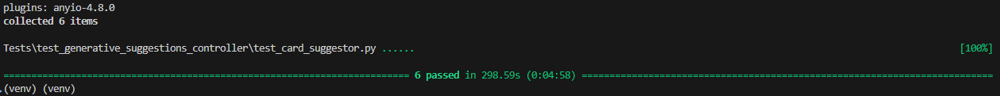

# SENG 401 PROJECT GROUP 7 Testing Document

### Members

Sachin Seizer, Brendan SMILEY, Luca Rios, Cody Casselman, Rohan Lange and Wade Banman

# Introduction

For our application, the following systems are considered to be critical:

- [Database Connection](#Database-connection) (including create/read/update/delete)
- [Large Language Model querying](#LLM-Connector)
- [ScryFall API querying](#scryfall-connector)
- [User login Authenticaion](#authentication-system)
- [Frontend-backend connection](#frontend-to-backend-apis)

While not as critical, a test suite for [frontend navigation](#frontend-navigation) was done as well to ensure user experience was smooth while using our application.

# Tests

## Database Connection

### Test Results

The databases connector is comprised of three classes:

- DatabaseConnector - the class responsible for the actual connection to the database and execution of queries
- CardQueries - class responsible for formatting queries for the card table
- DeckQueries - class responsible for formatting queries for the deck table

### Test Datasets

DatabaseConnector - no data required

CardQueries:

    cards = [
        {'cardname': 'Card A', 'sideboard': False, 'cardtype': 'Creature', 'count': 3},
        {'cardname': 'Card B', 'sideboard': True, 'cardtype': 'Sorcery', 'count': 2},
        {'cardname': 'Card C', 'sideboard': False, 'cardtype': 'Instant', 'count': 4},
        {'cardname': 'Card D', 'sideboard': True, 'cardtype': 'Enchantment', 'count': 1}
        ]

DeckQueries:

    decks = [
        ["10", "Commander", "Deck1", "Card A"],
        ["10", "Commander", "Deck2", None],
        ["10", "Standard", "Deck3", None],
        ["20", "Commander", "Deck4", None],
        ["20", "Modern", "Deck5", None]
    ]

### Test Validation

Force each class, weak Equivalence class testing (ECT) and Boundary Value Testing (BVT) was used to develop test cases. This meant:

- Test with valid inputs
- Test with inputs right at the boundary of validity
- Test with error inputs

#### DatabaseConnector:

The main aspects to be tested:

1. Being able to connect to the database
2. Allowing only one instance of the class (to ensure single point of connection to database)

Test coverage:

1. TC-DC01, TC-DC03
2. TC-DC02

#### CardQueries:

The main aspects to be tested:

1. Insertion of rows
2. Reading of rows
3. Update of rows
4. deletion of rows

Test coverage:

1. TC-CQ01 - TC-CQ08
2. TC-CQ09, TC-CQ10
3. TC-CQ11 - TC-CQ16
4. TC-CQ17 - TC-CQ23

#### DeckQueries

The main aspects to be tested:

1. Insertion of rows
2. Reading of rows
3. Update of rows
4. deletion of rows

Test coverage:

1. TC-DQ01 - TC-DQ05
2. TC-DQ06 - TC-DQ09
3. TC-DQ10 - TC-DQ13
4. TC-DQ14 - TC-DQ16

## Frontend to Backend APIs

### Test Results

The frontend to backend API's mainly consist of routes used to passed data from the user to the database and routes used to pass data from the user to scryfall as seen in the list of routes below

 
### Test Datasets

Card specific urls datasets:

    data = {
        "name": "Abrade"
    }

Card batch url datasets:

    data = {
        "names": ["Abrade", "Arcane Signet", "Invalid Card"]
    }

Add and remove datasets:

    data = {
        "num_to_add": 1,
        "num_to_remove": 2,
        "decklist": {
            "commander": "Marchesha The Black Rose",
            "mainboard": [
            {
                "name": "Ashnod's Al",
                "quantity": 1
            },
            {
                "name": "Demonic Tut",
                "quantity": 1
            },
            {
                "name": "Counterspell",
                "quantity": 1
            },
            {
                "name": "Sol Ring",
                "quantity": 1
            },
            {
                "name": "Swamp",
                "quantity": 9
            },
            {
                "name": "Island",
                "quantity": 9
            },
            {
                "name": "Mountain",
                "quantity": 12
            }
            ]
        }
    }

For all other API's involving database connection the data format is the same as mentioned above for card and deck queries

### Test Validation

Verify Cards:
    Aspects to be tested:
        1 - test that verify cards works when passed a valid list of names
        2 - test that verify cards returns correct response when there are invalid cards
    Test Coverage:
        1 - TC-AP01
        2 - TC-AP02
Get Image Links:
    Aspects to be tested:
        1 - Ensure that route successfully returns image links for requested card
    Test Coverage:
        1 - TC-AP03
Get Commander:
    Aspects to be tested:
        1 - Ensure that route successfully returns data related to the provided commander
    Test Coverage:
        1 - TC-AP04
Get Suggestions:
    Aspects to be tested:
        1 - Ensure that route successfully returns suggestioned create by gemini llm
        2 - Ensure route still works when no changes are requested (edge case)
    Test Coverage:
        1 - TC-AP05
        2 - TC-AP06
Get autocomplete suggestions:
    Aspects to be tested:
        1 - Ensure that route successfully returns potential autocomplete options when searching for an actual card
        2 - Ensure route successfully indicates when there are no potential autocomplete options
    Test Coverage:
        1 - TC-AP07
        2 - TC-AP08
Get decks:
    Aspects to be tested:
        1 - test that route returns successfully when retrieving an actual deck
        2 - test that route returns properly when retrieving a non-existent deck
    Test Coverage:
        1 - TC-AP09
        2 - TC-AP10
Get user decks:
    Aspects to be tested:
        1 - test that route returns successfully when retrieving decks for a proper user
        2 - test that route returns properly when retrieving decks for a non existent user
    Test Coverage:
        1 - TC-AP11
        2 - TC-AP12
Update Deck:
    Aspects to be tested:
        1 - Ensure that route returns properly after call and check that database is successfully updated
    Test Coverage:
        1 - TC-AP13
Create Deck:
    Aspects to be tested:
        1 - Ensure that route returns properly after call and check that database is successfully updated
    Test Coverage:
        1 - TC-AP14

## Additional Coverage within API testing

Along with confirming that all routes are functioning as expected these test also ensure that user token authentication is behaving as expected within tests TC-AP09 -> TC-AP14

## LLM Connector

### Test Results

There are two main aspects of the AI connector to test: Getting suggestions on cards to remove, and getting suggestions on cards to add.

### Test Datasets

The following dataset is a sample of a list of cards that would be passed to the LLM for processing

    {
    "num_to_add": 1,
    "num_to_remove": 2,
    "decklist": {
        "commander": "Marchesha The Black Rose",
        "mainboard": [
        {
            "name": "Ashnod's Al",
            "quantity": 1
        },
        {
            "name": "Demonic Tut",
            "quantity": 1
        },
        {
            "name": "Counterspell",
            "quantity": 1
        },
        {
            "name": "Sol Ring",
            "quantity": 1
        },
        {
            "name": "Swamp",
            "quantity": 9
        },
        {
            "name": "Island",
            "quantity": 9
        },
        {
            "name": "Mountain",
            "quantity": 12
        }
        ]
    }
    }

### Test Validation

Test validation for this method requires quantitative and qualitative analysis. For the quantitative analysis, we need to validate that the AI returns the information in the required format. An example can be seen [here](./media/prompt.txt). The following test cases cover either the common cases or error cases expected from the LLM.
Test validation for this method requires quantitative and qualitative analysis.  For the quantitative analysis, we need to validate that the AI returns the information in the required format.  An example can be seen [here](./media/prompt.txt).  The following test cases cover either the common cases or error cases expected from the LLM.

Common cases:

- TC-CS01, TC-CS02, TC-CS04, TC-CS05, TC-CS06

Error cases:

- TC-CS03

In terms of qualitative analysis, in regard to whether the quality of the suggestion is accurate, needs to be done manually. After testing with various real life decks and comparing the suggestions of the LLM with reputable sources such as EDHRec and Moxfield, we can assert that the AI is giving accurate suggestions. Validating the quality of the results would be an ongoing process, as new cards are released, shifting the meta and changing which cards would consider valid suggestions by the LLM.

## Scryfall Connector

### Test Results

### Test Datasets

test datasets would include the full/partial names of magic the gathering cards. such as:

    "Demonic Tutor"
    "Demonic"
    ""

### Test Validation

The ScryFallEngine class has one function to test. Can it send and receive data from the ScryFall API. Tests TC-SE01 and TC-SE02
test the common and boundary cases for the class. We can validate the correctness of the reponse by whether the response of the API was what was intended be received. In the example of an input of "Demonic" this is an incomplete card name for the full card name "Demonic Tutor". If the API returns "Demonic Tutor" the test passes.

## Frontend Navigation

For frontend navigation we made use of exploratory testing. Below is our exploratory testing charter

| Test case                        | Explore                                          | using                                               | to                                                                   |     |
| -------------------------------- | ------------------------------------------------ | --------------------------------------------------- | -------------------------------------------------------------------- | --- |
| login                            | user login                                       | the auth0 login page                                | see if users can create/login to their accounts                      |     |
| Get suggestions                  | user deck suggestions                            | the create deck page/get suggestions method         | see if users can input their deck to get suggestions                 |     |
| accepted deck formats            | text recognitition for various deck list formats | the three different export methods used by moxfield | see if our website supports the most common deck formats             |     |
| load existing deck               | fetching a saved deck from database              | a test account with a saved deck within             | see if registered users can access their saved decks                 |     |
| input erroneous deck information | error catching                                   | the deck creation page                              | see if the website will catch user errors when inputting their decks |     |
| commander search autofill        | autofill commander name                          | the find you commander feature                      | see if the website will autofill partially inputted commander names  |     |
| mobile app support               | using the app on your phone                      | my phone                                            | see if the website works on the phone                                |     |

### Test Results

Our exploratory testing managed to successfully complete all of the tasks listed in the above table

### Test Datasets

For testing the website, a deck from Moxfield was used as sample data, as this is the mostly likely source where users using our website will get their data from. The deck used for testing can found [here](https://moxfield.com/decks/SE4kNjfWsUy3bgm61p3-vQ). The sideboard data is ignored as that is not relevant to the testing.

### Test Validation

For our website, these are the main features that needed to be tested

1. basic navigation
2. login
3. editing a deck
4. getting suggestions
5. Mobile navigation

Our exploratory testing charter covers all of those aspects. Since the test was done manually as a user, we can be confident that our website will work as expected with real end users as we performed all the actions they would perform.
