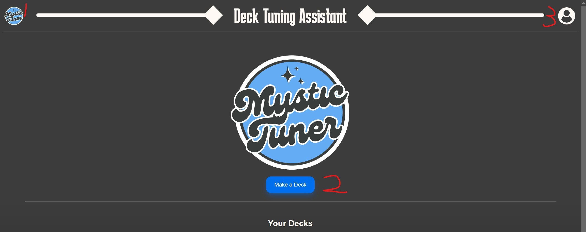

# Introduction

To access our website, head to [https://mystictuner.live/](https://mystictuner.live/)

From there, you'll be routed to our home page.  It should look like this:

Main points

1. You can click this button at any time to return to this home page
2. You can click this button to head to the next page to input your deck data
3. You can click this to login/sign in using our Auth0 authentication system

Click 2

Main points

1. You can input the name for your deck here.  Put whatever you'd like.
2. Click this button to use our autocomplete field to search for a valid commander.  First try putting in "Aurelia" into the field. In the backend our application will send your partially completed card name to the ScryFall API.  From there, it will return a list of legal cards (if any) that may match what you were trying to search for.  You should see three options pop up.  Now delete that and put in "taii" into the search field.  When you see "Taii Wakeen, Perfect Shot" appear click it and click commander found.  The card's image should pop up in that black box.
3. Here you can fill it with a deck list.  copy paste the sample data found in [this text file](./media/decklist.txt).
4. Once you've done the above, click this button to save the deck.

Once you've done that, these buttons should appear in its stead.

If you're unsatisfied with your current deck, you can hit edit deck and return to the previous instructions, otherwise click get suggestions.  Specify how many cards you wish the AI to suggestion to add/remove from your deck and press Okay!.  At this point, the application will send your deck list to the LLM to get evaluated.  You'll be sent to a page with the suggestions.  Click any of the cards to see a reasoning for why the AI thinks you should add/remove that card.

The above is the main navigation loop of our application.  Addionally we have the login features.  If you wish, you can create an account and redo the steps you did above.  Except this time when you return to your home page you should see the deck you created sitting under the "Your Decks" header.